# Reference

This page list all gtk-rs examples with screenshots and a short description of
what it does.

## accessibility

This sample demonstrates how to make an application more accessible.

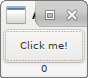

## basic

This sample demonstrates how to create a toplevel `window`, set its title, size
and position, how to add a `button` to this `window` and how to connect signals
with actions.

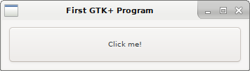

## basic_subclass

This file creates a `GtkApplication` and a `GtkApplicationWindow` subclass and
showcases how you can override virtual funcitons such as `startup` and
`activate` and how to interact with the GObjects and their private structs.

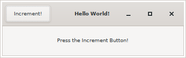

## builder_basics

This sample demonstrates how to use the builder with an imported glade file.

## builder_signal

This sample demonstrates how to handle signals in builder.

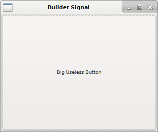

## builders

This sample demonstrates how to create a widget using the builders.

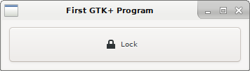

## cairo_png

This sample demonstrates how to create `ImageSurface`, draw on it and then save
result to PNG file.

Analog of C# example http://www.mgsloan.com/cairo_tut/stroke.cs

## cairotest

This sample demonstrates how to create draw using cairo.

## cairo_threads

This sample demonstrate how render in threads.

## child-properties

This sample demonstrates how to set child properties.

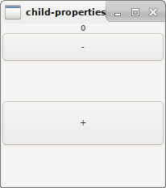

## clipboard_simple

This sample demonstrates how to manipulate clipboard.

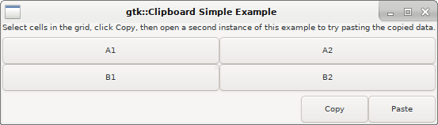

## clock

This sample demonstrates how to use `gtk::timeout_add_seconds` to run a
periodic, implementing a clock in this example.

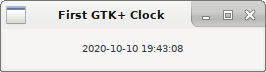

## clone_macro

This sample demonstrates how to use `gtk::clone` macros for passing variables
as strong or weak references into a closure.

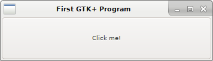

## communication_thread

Example on how to use a communication thread alongside with the GUI thread.

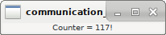

## css

This sample demonstrates how to use CSS with gtk-rs.

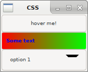

## drag_and_drop

This sample demonstrates how manipulate drag and drop.

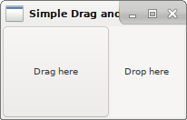

## drag_and_drop_text_view

This sample displays a list of filenames when they're dropped on the textview
widget.

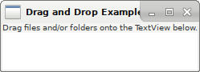

## entry_completion

This example demonstrates how to build a list of items and use them to
autocomplete a field as the user types in something.

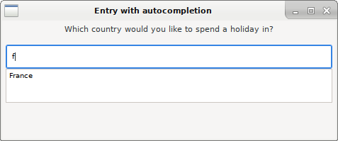

## grid

This sample demonstrate how to organize widgets inside grid container.

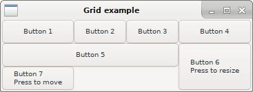

## gtktest

## iconview_example

This sample demonstrate how to use `IconView`.

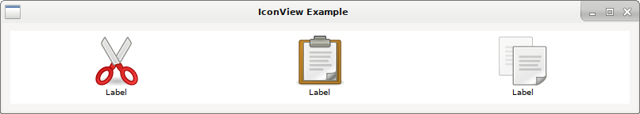

## list_store

This sample demonstrate how to use `ListStore`.

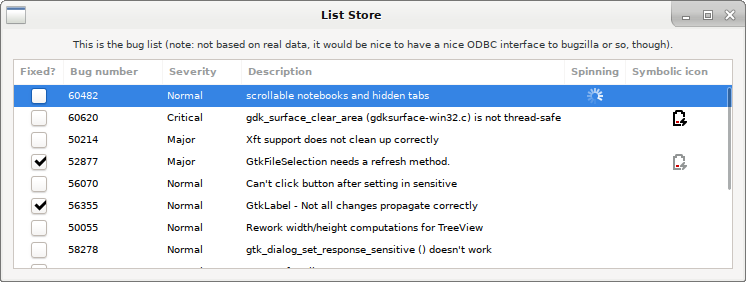

## menu_bar

This sample demonstrates how to use Menus/MenuBars and MenuItems in Windows.

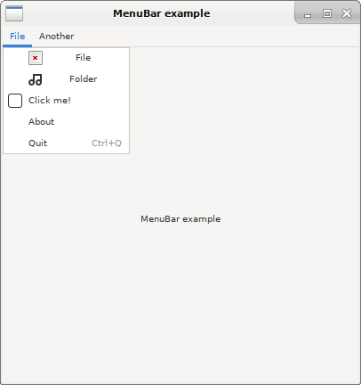

## menu_bar_system

This sample demonstrates how to create a "system" menu bar.

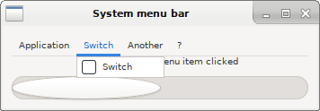

## multithreading_context

This sample demonstrates how to use thread with `MainContext`.

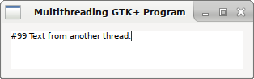

## multi_windows

This sample demonstrates how to use create multible windows.

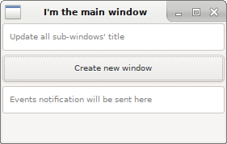

## notebook

This sample demonstrates how to use notebook-like tabs.

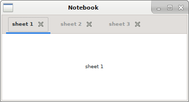

## overlay

This sample demonstrates how to create an element "floating" above others.

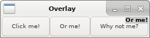

## pango_attributes

This sample demonstrates how to use various attributes on labels text.

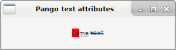

## printing

This sample reads text from two Entry fields, shows a print dialog and prints
both texts one below the other.

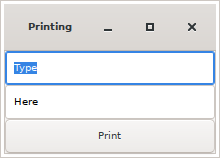

## progress_tracker

Track progress with a background thread and a channel.

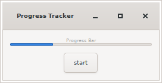

## simple_treeview

This sample demonstrates how to create a `TreeView` with a `ListStore`.

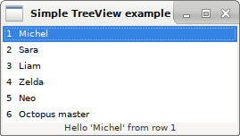

## sync_widgets

This sample demonstrates how to synchronize widgets.

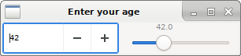

## text_viewer

A simple text viewer.

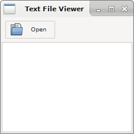

## transparent_main_window

This example demonstrates how to create a main window with a transparent
background.

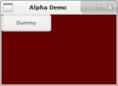

## tree_model_sort

This sample demonstrates how to use the `TreeModelSort` widget.

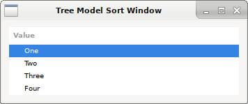

## treeview

This sample demonstrates how to create a `TreeView` with either a `ListStore`
or `TreeStore`.

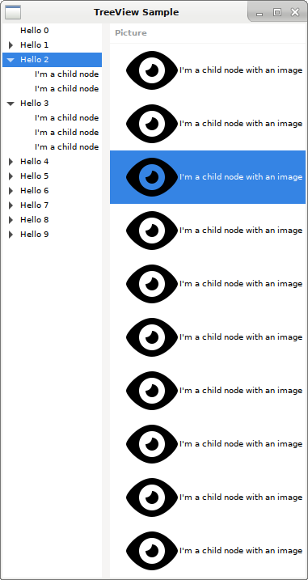

